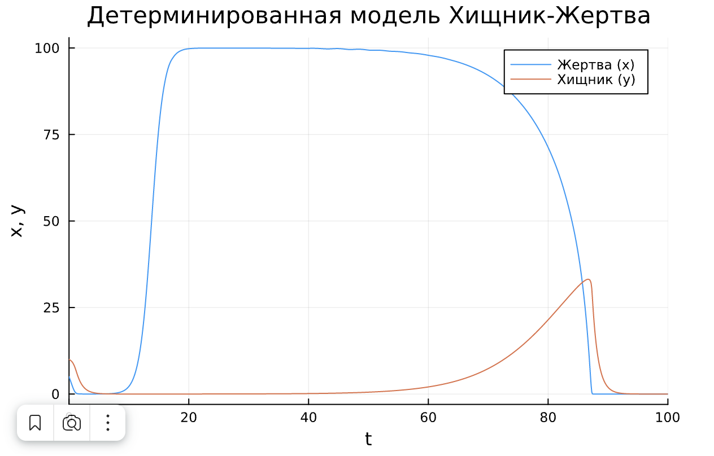
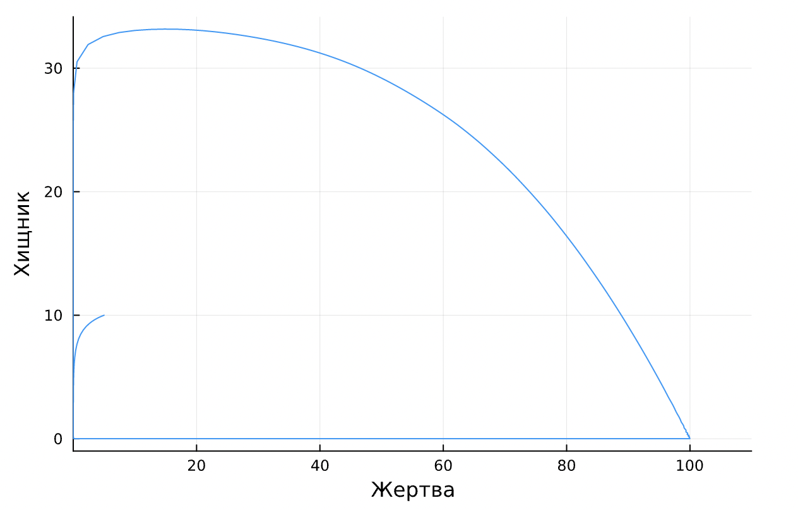
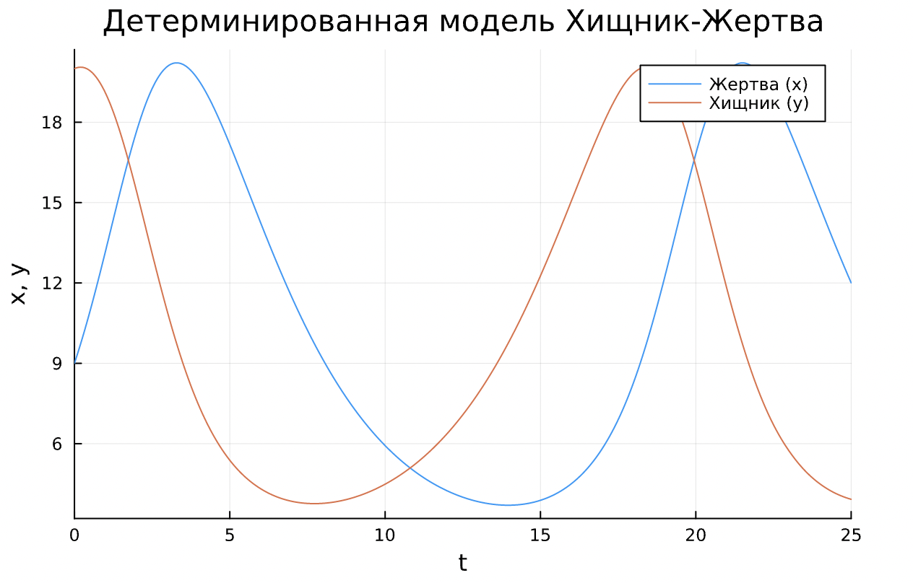
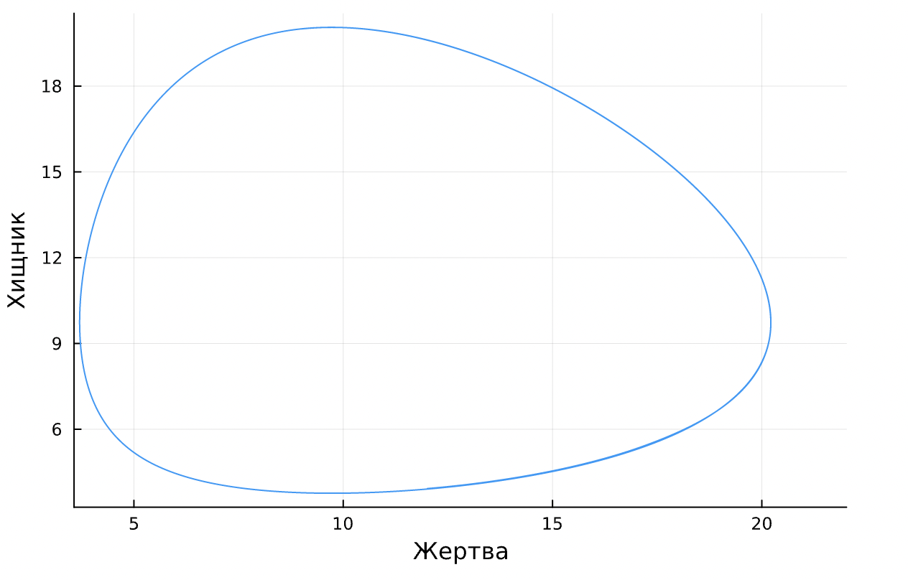

---
# Front matter
title: "Отчёт по НИР"
subtitle: "Модель 'Хищник-Жертва' с учетом конкуренции двух типов"
author: "Виктория Михайловна Шутенко"

# Generic otions
lang: ru-RU
toc-title: "Содержание"

# Bibliography
bibliography: bib/cite.bib
csl: pandoc/csl/gost-r-7-0-5-2008-numeric.csl

# Pdf output format
toc: true # Table of contents
toc_depth: 2
lof: true # List of figures
lot: true # List of tables
fontsize: 12pt
linestretch: 1.5
papersize: a4
documentclass: scrreprt
## I18n
polyglossia-lang:
  name: russian
  options:
	- spelling=modern
	- babelshorthands=true
polyglossia-otherlangs:
  name: english
  name: el
### Fonts
mainfont: PT Serif
romanfont: PT Serif
sansfont: PT Sans
monofont: PT Mono
mainfontoptions: Ligatures=TeX
romanfontoptions: Ligatures=TeX
sansfontoptions: Ligatures=TeX,Scale=MatchLowercase
monofontoptions: Scale=MatchLowercase,Scale=0.9
## Biblatex
biblatex: true
biblio-style: "gost-numeric"
biblatexoptions:
  - parentracker=true
  - backend=biber
  - hyperref=auto
  - language=auto
  - autolang=other*
  - citestyle=gost-numeric
## Misc options
indent: true
header-includes:
  - \linepenalty=10 # the penalty added to the badness of each line within a paragraph (no associated penalty node) Increasing the value makes tex try to have fewer lines in the paragraph.
  - \interlinepenalty=0 # value of the penalty (node) added after each line of a paragraph.
  - \hyphenpenalty=50 # the penalty for line breaking at an automatically inserted hyphen
  - \exhyphenpenalty=50 # the penalty for line breaking at an explicit hyphen
  - \binoppenalty=700 # the penalty for breaking a line at a binary operator
  - \relpenalty=500 # the penalty for breaking a line at a relation
  - \clubpenalty=150 # extra penalty for breaking after first line of a paragraph
  - \widowpenalty=150 # extra penalty for breaking before last line of a paragraph
  - \displaywidowpenalty=50 # extra penalty for breaking before last line before a display math
  - \brokenpenalty=100 # extra penalty for page breaking after a hyphenated line
  - \predisplaypenalty=10000 # penalty for breaking before a display
  - \postdisplaypenalty=0 # penalty for breaking after a display
  - \floatingpenalty = 20000 # penalty for splitting an insertion (can only be split footnote in standard LaTeX)
  - \raggedbottom # or \flushbottom
  - \usepackage{float} # keep figures where there are in the text
  - \floatplacement{figure}{H} # keep figures where there are in the text

---

# Анализ детерминированной модели

\begin{equation*}
 \begin{cases}
   \dot {x} = {x - \frac{xy}{1+\alpha x}} - \varepsilon x^2\\
   \dot {y} = {\gamma y - \frac{xy}{1+\alpha x}} - \delta y^2\\
 \end{cases}
\end{equation*}

Здесь $x$ – плотность популяции жертв, $y$ – плотность популяции хищников.

## **Поиск состояний равновесия**

Для нахождения состояний равновесия решим систему уравнений:

\begin{equation*}
 \begin{cases}
   {x - \frac{xy}{1+\alpha x}} - \varepsilon x^2 = 0\\
   {y} = {\gamma y - \frac{xy}{1+\alpha x}} - \delta y^2 = 0\\
 \end{cases}
\end{equation*}

Выражаем 2-е уравнение через х:

 $y({\gamma - \frac{x}{1+\alpha x}} - \delta y) = 0$

1) $y_1 = 0$   

2) ${\gamma - \frac{x}{1+\alpha x}} - \delta y = 0$ ; $y_2 = {\frac{\gamma}{\delta} - \frac{x}{\delta (1+\alpha x)}}$

**При $y=0$:**

$x-\varepsilon x^2 = 0$; $x(1-\varepsilon x)=0$

1. $x_1=0$
2. $1- \varepsilon x = 0$; $x_2 = \frac{1}{\varepsilon}$

Отсюда получаем 2 точки:

$M_1(0;0)$ и $M_2(\frac{1}{\varepsilon};0)$

Точка $M_1$ является точкой тривиального равновесия, при котором несуществуют и хищники, и жерты.
 
Точка $M_2$ не имеет биологического смысла, поскольку невозмозжно существование жертв без хищников.

**При $y={\frac{\gamma}{\delta} - \frac{x}{\delta (1+\alpha x)}}$**

${x - \frac{x(\frac{\gamma}{\delta} - \frac{x}{\delta (1+\alpha x)})}{1+\alpha x}} - \varepsilon x^2=0$

${x - \frac{\frac{x \gamma}{\delta} - \frac{x^2}{\delta (1+\alpha x)}}{1+\alpha x}} - \varepsilon x^2=0$

$x \frac{\delta(\varepsilon x-1)(\alpha x +1)^2 + \alpha \gamma x + \gamma -x}{\alpha \delta x + \delta}= 0 $

1. $x_1 = \frac{\alpha ^2 -2 \varepsilon \alpha \delta}{3 \varepsilon \alpha ^2 \delta} - \frac{1}{3 \sqrt[3]{2} \varepsilon \alpha ^2 \delta}$

2. $x_2 = \frac{\alpha ^2 -2 \varepsilon \alpha \delta}{3 \varepsilon \alpha ^2 \delta b} + \frac{1}{6 \sqrt[3]{2} \varepsilon \alpha ^2 \delta}$

Отсюда получаем 3 и 4 точку:

$M_3(\frac{\alpha ^2 -2 \varepsilon \alpha \delta}{3 \varepsilon \alpha ^2 \delta} - \frac{1}{3 \sqrt[3]{2} \varepsilon \alpha ^2 \delta};\frac{\gamma}{\delta} - \frac{x}{\delta (1+\alpha x)})$ и $M_4(\frac{\alpha ^2 -2 \varepsilon \alpha \delta}{3 \varepsilon \alpha ^2 \delta b} + \frac{1}{6 \sqrt[3]{2} \varepsilon \alpha ^2 \delta};\frac{\gamma}{\delta} - \frac{x}{\delta (1+\alpha x)})$

Точки $M_3$ и $M_4$ являются точками нетривиального равновесия, при котором существуют обе популяции.


## **Матрица Якоби.**

Для начала найдем частные производные:

$\frac{\partial(x)}{\partial x}= 1- \frac{y}{(1+\alpha x)^2}-2 \varepsilon x $

$\frac{\partial(y)}{\partial x}= \frac{-x}{1+\alpha x} $

$\frac{\partial(y)}{\partial y}= - \gamma + \frac{x}{1+\alpha x} - 2 \delta x  $

$\frac{\partial(x)}{\partial y}= \frac{y}{(1+\alpha x)^2} $

**Общий вид матрицы якоби**

\begin{pmatrix}
  1- \frac{y}{(1+\alpha x)^2}-2 \varepsilon x& \frac{-x}{1+\alpha x} \\
  - \gamma + \frac{x}{1+\alpha x} - 2 \delta x& \frac{y}{(1+\alpha x)^2}
\end{pmatrix}

Для точки $М_3(\frac{\alpha ^2 -2 \varepsilon \alpha \delta}{3 \varepsilon \alpha ^2 \delta} - \frac{1}{3 \sqrt[3]{2} \varepsilon \alpha ^2 \delta};\frac{\gamma}{\delta} - \frac{x}{\delta (1+\alpha x)})$

\begin{pmatrix}
  -1 &  \frac{-1}{\alpha+ \varepsilon}\\
  -\gamma + \frac{1}{\alpha+ \varepsilon} - 2\frac{\delta}{\varepsilon}& 0
\end{pmatrix}

**Характерестическое уравнение**

\begin{pmatrix}
  -1 - \lambda &  \frac{-1}{\alpha+ \varepsilon}\\
  -\gamma + \frac{1}{\alpha+ \varepsilon} - 2\frac{\delta}{\varepsilon}& 0 - \lambda
\end{pmatrix}

$\lambda_1 = -1$, $\lambda_2 = 0$

## Построение графиков

Прграммный код для построения графиков данной модели:

```
using Plots
using DifferentialEquations
using ParameterizedFunctions
using ImplicitEquations

g = 1
e = 0.01
a = 0.87
d = 0.0042
x0 = 5
y0 = 10

pp! = @ode_def PP begin
    dx = x - ((x*y)/(1+a*x)) - e*x^2
    dy = -g*y+((x*y)/(1+a*x))-d*y^2
end g e a d 

M = [x0,y0]

param=[g, e, a, d]

timespan = (0, 100)

problem = ODEProblem(pp!, M, timespan, param)

solution1 = solve(problem)

plot(solution1, title = "Детерминированная модель Хищник-Жертва", xlabel = "t", ylabel = "x, y", label=["Жертва (x)" "Хищник (y)"])

plot(solution1, vars=(1, 2), xaxis="Жертва", yaxis="Хищник",legend=false)

```

В результате выполнения данного кода, получается два графика:

{ #fig:001 width=70% }

{ #fig:002 width=70% }

# Построение классической модели Хищник-Жертва

```
using Plots
using DifferentialEquations
using ParameterizedFunctions
using ImplicitEquations

g = 0.37
e = 0.038
a = 0.36
d =  0.037
x0 = 9
y0 = 20

pp! = @ode_def PP begin
    dx = -g*x+e*x*y
    dy = a*y-d*x*y
end g e a d 

M = [x0,y0]

param=[g, e, a, d]

timespan = (0.0, 25.0)

problem = ODEProblem(pp!, M, timespan, param)

solution1 = solve(problem)

plot(solution1, title = "Детерминированная модель Хищник-Жертва", xlabel = "t", ylabel = "x, y", label=["Жертва (x)" "Хищник (y)"])

plot(solution1, vars=(1, 2), xaxis="Жертва", yaxis="Хищник",legend=false)
```

В результате выполнения данного кода, получается два графика:

{ #fig:003 width=70% }

{ #fig:004 width=70% }